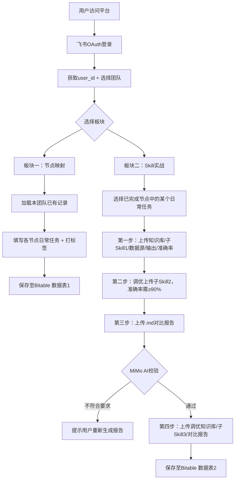

# FOD OperaSkill 平台建设方案

## 技术选型

- **框架**: Next.js 14 (App Router) + TypeScript + Tailwind CSS + shadcn/ui
- **数据库**: 飞书多维表格 Bitable（2张数据表）
- **文件存储**: 飞书云盘（指定 folder token 下）
- **认证**: 飞书 OAuth 2.0（获取 user_id 写入人员字段）
- **AI 校验**: MiMo API（OpenAI-compatible，校验对比报告）
- **部署**: Vercel（关联 GitHub Public 仓库）
- **域名**: 阿里云注册 + CNAME 指向 Vercel

---

## 工程目录结构

```
FOD-OperaSkill/
├── app/
│   ├── layout.tsx                  # 全局布局，含左侧导航栏
│   ├── page.tsx                    # 首页：飞书登录 + 团队选择
│   ├── section1/page.tsx           # 板块一：Skill↔流程节点映射
│   ├── section2/page.tsx           # 板块二：Skill实战生成（4步工作流）
│   └── api/
│       ├── auth/feishu/route.ts            # 发起 OAuth 跳转
│       ├── auth/feishu/callback/route.ts   # OAuth 回调，写 session cookie
│       ├── bitable/records/route.ts        # Bitable 增/查记录
│       ├── upload/route.ts                 # 文件上传至飞书云盘
│       └── validate-report/route.ts        # MiMo AI 校验 .md 报告
├── components/
│   ├── TeamSelector.tsx            # 团队选择器（含新增团队）
│   ├── NodeMappingGrid.tsx         # PTP 节点映射表格组件
│   ├── TaskLabelCard.tsx           # 任务打标卡片
│   ├── SkillStepWizard.tsx         # 4步上传向导
│   ├── ProgressDashboard.tsx       # 团队进度看板
│   └── DownloadCard.tsx            # 母Skill/skill-creator 下载卡片
├── lib/
│   ├── feishu.ts                   # 飞书 API 客户端（auth/bitable/drive）
│   ├── mimo.ts                     # MiMo API 客户端
│   └── constants.ts                # PTP 流程结构常量 + 图例定义
├── public/
│   ├── mother_framework_v1.1.3.zip
│   └── skill-creator.zip
├── .env.local                      # 已有（不提交 Git）
├── .gitignore
├── next.config.ts
└── package.json
```

---

## 飞书 Bitable 数据表设计

### 数据表1：流程节点映射

| 字段名 | 字段类型 | 说明 |
|--------|---------|------|
| 团队名称 | 文本 | 团队选择器输入值 |
| 提交者 | 人员 | 飞书 user_id |
| 流程环节 | 单选 | 合同管理/主数据管理/预提/对账结算/发票管理/付款/其他 |
| 流程节点 | 文本 | 具体节点名称 |
| 任务名称 | 文本 | 用户填写的日常任务 |
| 标签 | 单选 | 纯手工★ / 跨系统◆ / 不建议AI✕ |
| 提交时间 | 日期 | 自动填入 |

### 数据表2：Skill实战记录

| 字段名 | 字段类型 | 说明 |
|--------|---------|------|
| 团队名称 | 文本 | |
| 提交者 | 人员 | 飞书 user_id |
| 关联任务 | 文本 | 来自表1的任务名称 |
| 步骤编号 | 数字 | 1/2/3/4 |
| 内容类型 | 文本 | 知识库/子Skill1/准确率 等 |
| 文件链接 | 超链接 | 飞书云盘文件 URL |
| 准确率 | 数字 | % |
| AI校验结果 | 文本 | MiMo 返回的校验说明 |
| 步骤状态 | 单选 | 待完成/进行中/已完成 |
| 提交时间 | 日期 | 自动填入 |

---

## 核心业务流程



---

## 实施步骤

### Step 1：初始化 Next.js 项目
- `npx create-next-app@latest` 创建项目，配置 TypeScript + Tailwind + App Router
- 安装 shadcn/ui 组件库
- 配置 `.gitignore`（排除 `.env.local`）

### Step 2：飞书集成基础层
- `lib/feishu.ts`：封装 `tenant_access_token` 获取、Bitable CRUD、云盘上传、OAuth 流程
- 创建 `/api/auth/feishu` 和 `/api/auth/feishu/callback` 路由
- Session 管理：使用 `iron-session` 或 JWT cookie 存储用户 user_id

### Step 3：Bitable 数据表初始化
- 调用飞书 API 在 `FEISHU_DRIVE_FOLDER_TOKEN` 目录下创建多维表格
- 建立两张数据表及字段结构（在 agent 模式下执行一次性初始化脚本）

### Step 4：板块一 UI + API
- `constants.ts` 中定义 PTP 七大环节及所有子节点数组
- `NodeMappingGrid.tsx`：多列可折叠的表格，每个节点下可添加多条任务行并打标签
- `TeamSelector.tsx`：下拉选择+新增输入，选中后从 Bitable 加载本团队历史数据
- `/api/bitable/records`：读写数据表1

### Step 5：板块二 UI + API（4步向导）
- `SkillStepWizard.tsx`：分步骤展示，步骤间有锁定逻辑（前步未完不可进入后步）
- 文件上传：`/api/upload` 接收文件 → 上传至飞书云盘 → 返回文件链接
- 第二步准确率验证（90% 门槛前端+后端双重校验）
- 第三/四步报告 `.md` 上传时：读取文件内容 → 调用 `/api/validate-report` → MiMo AI 判断是否包含三个必要分析点

### Step 6：进度看板
- `ProgressDashboard.tsx`：查询 Bitable 表2，统计团队各任务完成情况，显示总进度条

### Step 7：GitHub 仓库创建 + 推送
- 调用 GitHub MCP `create_repository`（Public，名称 `FOD-OperaSkill`）
- 初始化 commit 推送所有代码（`push_files` 或 git push）

### Step 8：Vercel 部署 + 域名配置
- 在 Vercel 导入 GitHub 仓库，配置所有环境变量
- 阿里云注册域名 → 在 Vercel 添加自定义域名 → 阿里云 DNS 添加 CNAME 记录指向 Vercel

---

## 注意事项

- **`.env.local` 绝对不提交 Git**（飞书/MiMo 密钥），仅在 Vercel 环境变量中配置
- **飞书 OAuth 需要**：在飞书开放平台后台为 `cli_a73764b8de38d063` 应用开启「网页应用」并配置回调域名（Vercel 域名或自定义域名）
- **母Skill 和 skill-creator.zip** 作为静态文件放在 `public/` 目录，供用户下载
- **Vercel 在中国大陆访问不稳定**，自定义域名后需在阿里云开启 HTTPS + 确认 DNS 正常解析即可（Vercel 免费 SSL）