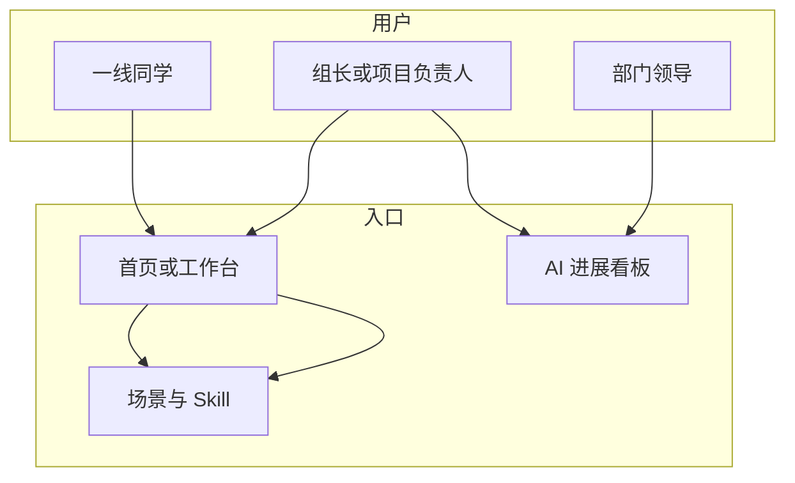

# FOD OperaSkill 产品设计文档（PRD 摘要版）

| 项目 | 说明 |
|------|------|
| 用途 | 评审用：同事与财务部领导快速了解价值与能力边界 |
| 产品 | FOD OperaSkill — 财务部 FOD · AI Skill 作业收集与管理平台 |
| 读法 | 先下图 → 再「一句话」与「功能」；插图区可换截图 / GIF |

> **图注：** 飞书文档若不能直接渲染 Mermaid，可在 VS Code / GitHub 预览后**截图为图片**插入本节对应位置。

---

## 〇、流程一览（建议先看图）

### 全链路：从分散作业到统一收口

### Skill 创建：四步主路径

### 角色与入口（谁从哪进）

---

## 一、一句话

**把全 FOD 的 AI Skill 相关作业收进一个入口：场景 → Skill → 资料与知识库 → 看板，做到看得见、管得住、跟得上。**

---

## 二、痛点 → 对策

| 痛点 | 对策 |
|------|------|
| 信息散在聊天、网盘、各自表格 | 统一页面 + 统一数据结构登记 |
| 阶段与质量标准不一致 | 固定步骤（如四步 Skill）、准确率与 AI 校验导向 |
| 组织层看不清进度与卡点 | 看板、统计、卡点 / 目标登记 |
| 跨团队复用难 | 统一术语（场景、步骤、团队）与知识库绑定 |

---

## 三、定位与价值（三句话可对外说）

1. **统一管理**：全 FOD Skill 作业在同一套流程里登记与追踪。  
2. **流程可见**：场景梳理 → Skill 多步，便于对齐与催办。  
3. **结果可衡量**：版本、准确率、校验记录可复盘、可横向对比。

| 对象 | 价值 |
|------|------|
| 业务同学 | 知道「下一步交什么」；按 PTP 等环节梳理场景 |
| 组长 / 项目负责人 | 按团队看进度、卡点、产出 |
| 部门领导 | 看板回答覆盖面、进展、质量，**不必懂技术细节** |

---

## 四、谁能用

- **一线**：本团队下录场景、走 Skill 各步上传与自评。  
- **管理员**：团队维度维护、看板与评测配合（以实际配置为准）。  
- **他组只读**：界面明确「只读」，避免误改（以权限策略为准）。  

**登录**：飞书账号；首次引导选归属团队，保证统计按团队准确。

---

## 五、功能模块（按菜单理解）

### 5.1 场景梳理

按 **环节 → 节点 → 场景** 登记；打标签（线下优先、跨系统手工、暂不建议 AI 等）与 **归属范式**；支持批量打标。

**【插图预留 ①】** 场景梳理整页；可选 GIF：新增场景 / 批量打标。

---

### 5.2 Skill 创建

四步见上文「〇」中第二张图。单步内可登记 **卡点**、**明日关键目标**，便于例会。

**【插图预留 ②】** 四步步骤条 + 当前步表单；可选 GIF。

---

### 5.3 我的工作台

个人入口聚合：场景梳理、Skill、知识库、评测等卡片 + **我的动态**，快速续办。

**【插图预留 ③】** 工作台整页（`/workbench`）。

---

### 5.4 AI 进展看板

进度与产出汇总；**流程 → 环节 → 节点** 筛选，从粗到细下钻。

**【插图预留 ④】** 看板列表 / 卡片；有「场景资产」Tab 可另截一张。

---

### 5.5 知识库管理

与流程、节点、场景绑定；**绑定范围**（节点级 / 场景级）控制适用范围；筛选、发布 / 归档；审核结果可通知提交人（以飞书配置为准）。

**【插图预留 ⑤】** 知识库列表 + 表单。

---

### 5.6 评测与测试包

**评测集**：绑场景、资料与催办；卡片提示资料是否齐。  
**测试包**：与知识库版本等联动。  
**上传测评结果**：版本号系统带出，用户主要填准确率与上传文件。

**【插图预留 ⑥】** 评测相关 1～2 张。

---

### 5.7 首页与导航

摘要：近期活跃、进行中事项；导航可折叠、侧栏可收起。

**【插图预留 ⑦】** 登录后首页。

---

## 六、以前 vs 现在

| 以前 | 现在 |
|------|------|
| 各组自建表、命名不一 | 统一字段：场景、步骤、团队 |
| 进度靠口头 | 步骤状态、时间、看板可查 |
| 质量靠自觉 | 准确率导向、报告 AI 校验、评测闭环 |
| 领导难全局 | 看板支撑例会与管理决策 |

---

## 七、非目标（对齐预期）

- **不替代**飞书文档与网盘，是与身份、多维表、云盘 **协同**。  
- **AI 校验** 辅助完整性，**业务结论人负责**。  
- 字段、权限、域名以 **贵司实际配置** 为准。

---

## 八、插图清单（贴飞书前自检）

- [ ] ① 场景梳理 ② Skill 四步 ③ 工作台 ④ 看板 ⑤ 知识库 ⑥ 评测 ⑦ 首页  
- 飞书里可删「【插图预留】」整段，换原生图片 / GIF。

---

## 九、修订记录

| 日期 | 修订人 | 说明 |
|------|--------|------|
| 2026-04-29 | （待填） | 首版 |
| 2026-04-29 | （待填） | 增补流程图、全文凝练 |

---

*技术实现见同目录《FOD_OperaSkill_技术方案文档》。*
