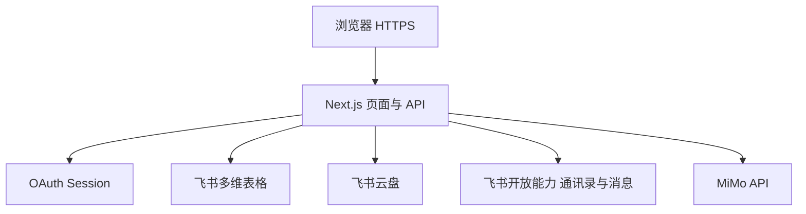
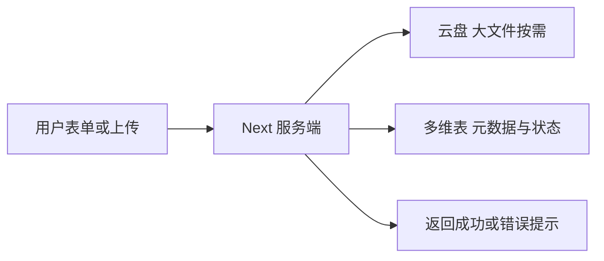

# FOD OperaSkill 技术方案文档（评审友好版）

| 项目 | 说明 |
|------|------|
| 用途 | 配套 PRD：架构、数据、安全、部署；领导可只读「〇」与本节流程图 |
| 关联 | `FOD_OperaSkill_产品设计文档.md` |
| 插图 | 文中 A～F 占位可换截图 / GIF |

> **图注：** 飞书若不渲染 Mermaid，请**截图**下图插入本节。

---

## 〇、流程一览（建议先看图）

### 请求链路：用户到各系统

### 上线与迭代（概念顺序）

### 数据写入示意（保存一次提交）

---

## 一、领导摘要（约 1 分钟）

- **形态**：浏览器 Web；**飞书登录**。  
- **数据**：业务在 **飞书多维表格**；大文件在 **飞书云盘**，平台存链接与元数据。  
- **智能**：报告等环节调 **MiMo**（模型与 Key 走环境变量）。  
- **部署**：常见为 **Vercel**；域名与 OAuth 回调需在飞书后台配置。

**【插图预留 A】** 总览架构图（可与上图二选一或并存）。

---

## 二、建设目标（技术对齐业务）

| 目标 | 含义 |
|------|------|
| 统一入口 | Next.js 路由：工作台、场景、Skill、看板、知识库、评测等 |
| 统一模型 | 多维表分表：场景、Skill 记录、人员团队、统计、卡点目标、知识库 |
| 可审计 | 提交人、时间、版本等字段支撑导出与复盘 |
| 可扩展 | 外部集成集中在 API Route，前端做交互与权限展示 |

---

## 三、总体架构（文字对照上图）

- **Session**：Cookie Session（如 iron-session），敏感令牌不长期明文落浏览器。  
- **权限**：飞书身份 + 表内团队 / 角色；只读团队前端禁用提交类按钮。  
- **密钥**：仅服务端持有，**浏览器不暴露** App Secret。

**【插图预留 B】** 数据流截图（可与「〇」中数据写入示意图二选一）。

---

## 四、技术栈

| 层 | 选型 | 说明 |
|----|------|------|
| 应用 | Next.js 14 App Router | 前后端同仓；Route Handlers |
| 实现 | TypeScript + Tailwind | 类型与 UI |
| 身份 | 飞书 OAuth 2.0 | 企业账号 |
| 结构化数据 | 飞书多维表格 | 结构随 `migrate-*` 演进 |
| 文件 | 飞书云盘 | 大文件不上业务机磁盘 |
| AI | MiMo API | 可配 base URL、模型 |
| 托管 | Vercel（推荐） | 与环境变量、域名联动 |

**【插图预留 C】** 可选：`package.json` 核心依赖截图（技术同事用）。

---

## 五、数据设计（概念级）

字段级以 `README` 与飞书表为准；分表目的如下：

| 逻辑表 | 用途 |
|--------|------|
| 场景映射 | 团队、环节、节点、场景、标签、归属范式 |
| Skill 记录 | 绑场景、步骤、文件、版本、准确率、AI 校验、状态 |
| 人员团队 | open_id、归属团队、角色、部门 |
| 日统计 | 看板汇总 |
| 卡点 / 明日目标 | 绑流程与场景步骤 |
| 知识库 | 绑流程、绑定范围、生命周期、提交人（通知用） |

**原则**：业务可读「场景 / 步骤」与扩展型记录分离；迁移接口 **幂等** 加字段并回填。

**【插图预留 D】** 多维表各 Tab 截图（对外请脱敏）。

---

## 六、接口索引（实际以代码为准）

| 类型 | 路径示例 | 用途 |
|------|-----------|------|
| 认证 | `/api/auth/feishu`、`callback`、`logout`、`me` | 登录与当前用户 |
| 表 | `/api/bitable/init`、`records`、`teams`、`migrate-*` | 初始化、读写、升级 |
| 业务 | `/api/dashboard/*`、`/api/evaluation/*`、`knowledge`、`upload` | 看板、评测、知识库、上传 |
| 飞书 | `/api/feishu/search-users` | 通讯录搜索 |

---

## 七、安全要点

| 项 | 做法 |
|----|------|
| 密钥 | 环境变量 / 平台密钥库 |
| 身份 | OAuth + Session 策略 |
| 数据 | 按团队隔离；跨团队只读由角色约束 |
| 文件 | 实体在云盘，应用侧 token / 链接 |

**【插图预留 E】** 可选：飞书应用权限列表（脱敏）。

---

## 八、部署与环境

1. `npm run build` → `npm start` 或 Vercel。  
2. 变量见 `.env.local.example` 与 Vercel 项目配置。  
3. 飞书：网页应用、回调 URL、应用对表与盘的权限。  
4. 首次：`init` 等绑定表结构（见 README）。

**【插图预留 F】** 访问地址或登录后地址栏（可打码）。

---

## 九、运维与升级

- 表结构升级：`POST /api/bitable/migrate-*`，**按 README 顺序**，避免「前端已发、表未迁」空白。  
- 排障：Vercel / 网关日志 + 飞书 API 报错。  
- 备份：遵循飞书侧策略；平台不承担企业级备份替代责任。

---

## 十、边界与风险

- 依赖飞书与网络；API 限流或变更需适配。  
- 模型输出有随机性；**重要结论人工复核**。  
- 大附件与高并发列表需随数据量观察与优化。

---

## 十一、插图清单

- [ ] A 总览 B 数据流 C 依赖（可选）D 多维表 E 权限 F 访问示意  

飞书中可删占位段，换图片并加一句图注。

---

## 十二、修订记录

| 日期 | 修订人 | 说明 |
|------|--------|------|
| 2026-04-29 | （待填） | 首版 |
| 2026-04-29 | （待填） | 增补流程图、全文凝练 |

---

*字段与迁移细则以 `README.md` 与源码为准。*
